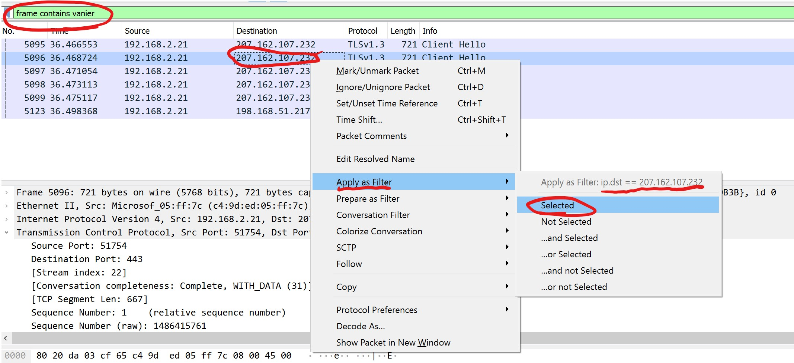

# Lab 2 - Section 1221

### Deadline: Sunday, 11:59pm 3rd of September, 2023

# Prerequisite Steps
1. Download and install the npcap library (you only need to install it, you don't need to run it): [download](https://npcap.com/dist/npcap-1.76.exe)
1. Download and install Wireshark packet capture software: [download](https://www.wireshark.org/download.html)
> If you install the npcap library after Wireshark, please restart wireshark afterwards


# Task 1
1. Open wireshark.
1. Capture the network interface that is connected to the internet by clicking `Capture`, which prompts the window below: (the window could be prompted upon openning)


1. You should start seeing the packets flowing in and getting captured by Wireshark


1. While wirshark **is capturing**, open your browser and go to: [http://www.altoromutual.com/](http://www.altoromutual.com/)

1. Click on "Sign in" or "Online Banking Login"

1. Enter your first name as a username and any random password (do NOT put a password that you usually use, because we do not know if we can trust this website.)
> It's normal to get an error in Step 6 for the login information entered. We're not interested in the login itself. The purpose of this is to sniff the packets.

1. Go back to the wireshark window and click on the red square at the top to stop capturing the packets:


1. In the filter section, type: `frame contains "login"` to filter for the login packets.


1. Locate the packet that is responsible for sending the login request to altormutual.com and go through the details of the packet. We are looking for the password in the packet.

1. Take a screenshot of the packet showing the password in the screenshot and save it for submission.

1. Exit wireshark and click on "Save" the captured packets when prompted. Save it in a location you can retrieve later for submission.


# Task 2
1. Open wireshark.
1. Capture the network interface that is connected to the internet by selecting `Capture` if not prompted by the window below:


1. You should start seeing the packets flowing in and getting captured by Wireshark


1. While wirshark **is capturing**, open your browser and go to: [https://vaniercollege.omnivox.ca/](https://vaniercollege.omnivox.ca/)

1. If you're logged in, log out and then log in again.

1. Go back to the wireshark window and click on the red square at the top to stop capturing the packets:


1. In the filter section, type: `frame contains "vanier"` to filter for the login packets.


1. You will most likely only see the handshake packets, right-click on the Destination IP on one of the "Client Hello" packets and select Apply as Filter -> Selected as shown below:


1. After applying the filter above, you will now be able to see all the packets captured from your login to Vanier Omnivox. Go through the packets and try to find your login information (username and password).

1. Exit wireshark and click on "Save" the captured packets when prompted. Save it in a location you can retrieve later for submission.


1. Create a new text file (using notepad or any text editor), and write in it the answers to the following questions:  

```
1. Were you able to find your vanier login information in the packet? Justify if yes or no
2. What is the difference between the login packets of Task 1 vs. the login packets of Task 2?
```

# Submission
- Zip the four files:
    - Screenshot from Task 1
    - Capture file (pcap) from Task 1
    - Capture file (pcap) from Task 2
    - Text file (with answers) from Task 2
- Submission is on Lea

