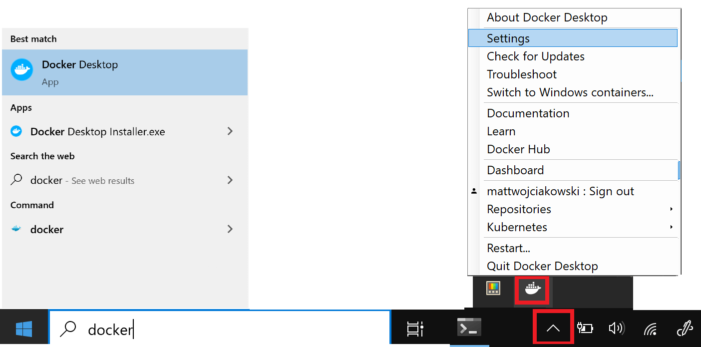
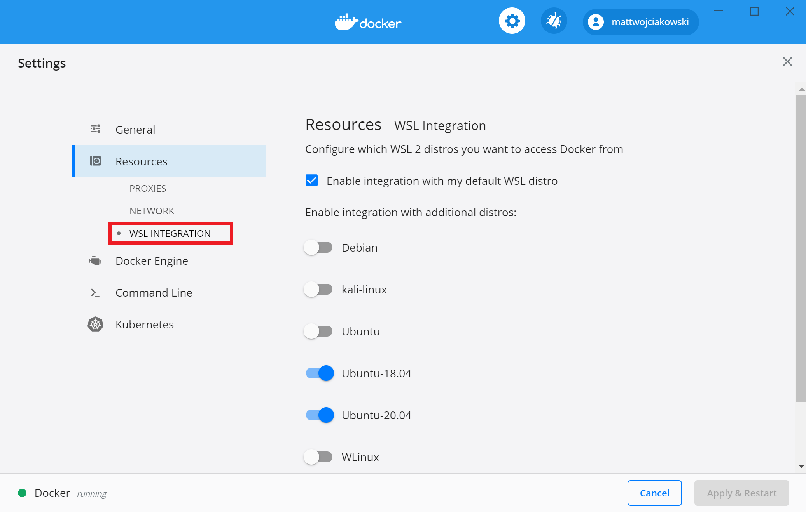

# Lab 3 - Section 2203

# Prerequisite Steps
1. [WSL2](./installing_wsl.md)

# Task 1: Install required softwares
### Docker
1. Install docker: [https://docs.docker.com/desktop/wsl/#turn-on-docker-desktop-wsl-2](https://docs.docker.com/desktop/wsl/#turn-on-docker-desktop-wsl-2)
1. Once installed, start Docker Desktop from the Windows Start menu, then select the Docker icon from the hidden icons menu of your taskbar. Right-click the icon to display the Docker commands menu and select "Settings".

1. Ensure that "Use the WSL 2 based engine" is checked in Settings > General. Docker Desktop general settings

1. Select from your installed WSL 2 distributions which you want to enable Docker integration on by going to: Settings > Resources > WSL Integration. Docker Desktop resource settings

1. To confirm that Docker has been installed, open a WSL distribution (e.g. Ubuntu) and display the version and build number by entering: `docker --version`
1. Test that your installation works correctly by running a simple built-in Docker image using: `docker run hello-world`

### Docker-compose
1. Open WSL (Ubuntu)
1. Run the docker-compose installation command.
    ```
    curl -SL https://github.com/docker/compose/releases/download/v2.20.3/docker-compose-linux-x86_64 -o ~/docker-compose
    ```
1. Copy docker-compose and change permissions
    ```
    sudo cp ~/docker-compose /usr/local/bin/docker-compose
    sudo chmod +x /usr/local/bin/docker-compose
    sudo ln -s /usr/local/bin/docker-compose /usr/bin/docker-compose
    ```
1. Test the installation:
    ```
    docker-compose version
    ```

### NodeJS and NPM
1. install nvm script:
    ```
    curl -o- https://raw.githubusercontent.com/nvm-sh/nvm/v0.39.5/install.sh | bash
    ```
    ```
    export NVM_DIR="$([ -z "${XDG_CONFIG_HOME-}" ] && printf %s "${HOME}/.nvm" || printf %s "${XDG_CONFIG_HOME}/nvm")"
    [ -s "$NVM_DIR/nvm.sh" ] && \. "$NVM_DIR/nvm.sh" # This loads nvm
    ```
1. Install node:
    ```
    nvm install node
    ```
1. Verify installation:
    ```
    node --version
    ```

# Task 2: OWASP Practice
1. Download and install postman [https://www.postman.com/downloads/](https://www.postman.com/downloads/)
1. Open WSL
1. Clone this repo in WSL: [https://github.com/nearform/owasp-top-ten-workshop/tree/master](https://github.com/nearform/owasp-top-ten-workshop/tree/master)
    ```
    git clone https://github.com/nearform/owasp-top-ten-workshop.git
    ```
1. Follow instructions at: [https://nearform.github.io/owasp-top-ten-workshop/1 ](https://nearform.github.io/owasp-top-ten-workshop/1)
1. On the webpage, use the arrows to the left and right to move to the next pages in the instructions.

