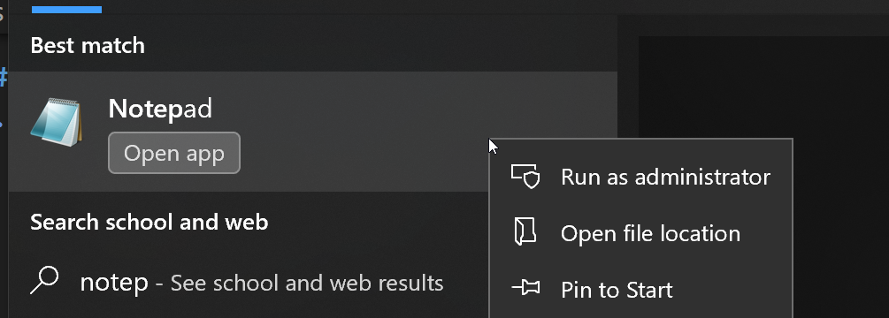
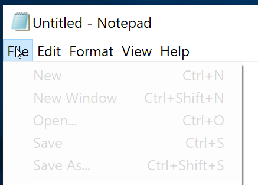

# Lab 4 - Section 2203

### Deadline: Friday 11:59pm, November 17th, 2023

In this lab, you will learn how to deploy and configure SSL certificates within a Docker container using locally signed certificates created with OpenSSL, securing a web server.

# Prerequisites
* Docker installed on your machine.
* OpenSSL installed on your wsl or macOS.
* WSL

## Task 1: Create SSL Certificate with OpenSSL Locally
1. Open a terminal on your local machine.
1. Use OpenSSL to generate a private key and a certificate signing request (CSR):
    ```bash
    openssl req -newkey rsa:2048 -nodes -keyout your_private_key.key -out your_csr.csr
    ```
1. Fill in the requested information for your certificate. Make sure you remember the hostname that you provided as you will need it in all the next steps.
1. Use the private key and CSR to create a self-signed certificate:
    ```bash
    openssl x509 -req -days 365 -in your_csr.csr -signkey your_private_key.key -out your_certificate.crt
    ```

## Task 2: Configure SSL in nginx.conf
1. Create an nginx.conf file in your project directory:
    ```nginx
    server {
        listen 443 ssl;
        server_name yourdomain.com;
        ssl_certificate /etc/ssl/your_certificate.crt;
        ssl_certificate_key /etc/ssl/your_private_key.key;
        # Additional SSL configurations go here...
    }
    ```

## Task 3: Create Dockerfile for Web Server with all configuration
1. Create an `ssl` directory and copy the SSL certificate files generated in Task 1 into it.
1. Create a Dockerfile in your project directory:
    ```Dockerfile
    FROM nginx:latest
    COPY nginx.conf /etc/nginx/nginx.conf
    COPY ssl/ /etc/ssl/
    ```


## Task 4: Build Docker Image
1. Open a terminal and navigate to your project directory.
1. Build the Docker image:
    ```bash
    docker build -t your-web-server .
    ```


## Task 5: Run Docker Container
1. Run the Docker container:
    ```bash
    docker run -d -p 443:443 --name your-web-container your-web-server
    ```


## Task 6: Verify SSL Configuration
1. Edit `hosts` file entries on your OS to add the domain of your web server to test `https` with the SSL certificate:
    * On Windows:
        * Open notepad as adminstrator:
        * 
        * Click on File and Open: 
        * Open the `hosts` file under the following path: `C:\Windows\System32\drivers\etc`
        * Add the following at the end of the file and save it
            ```hosts
            127.0.0.1 yourdomain.com
            ```
        * Make sure the host you're adding here `yourdomain.com` matches what you wrote in the SSL certificate and nginx configuration.
    * On MacOS:
        * Open terminal
        * `sudo vim /etc/hosts`
        * Add the following at the end of the file and save it
            ```hosts
            127.0.0.1 yourdomain.com
            ```
        * Make sure the host you're adding here `yourdomain.com` matches what you wrote in the SSL certificate and nginx configuration.
        * You can save in `vim` by typing `:wq` and then press Enter

1. Open a web browser and navigate to your domain (https://yourdomain.com).
1. Verify that the browser shows a secure connection (a padlock icon) and the certificate information is correct.

# Submission
There will be a submission box on Lea. Zip all the files/folders created above and submit them on Lea.
